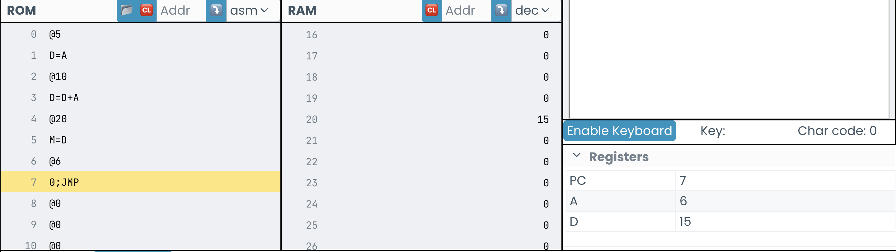

# Actividad 1
Esta es la actividad 1.

Se realizaron los ejercicios de Fetch-Decode-Execute

- uno
- dos
- tres

**negrita**

# Actividad 2
## Experimento (1)
- Se busca la dirección 1 y se almacena en D, luego se le suma la dirección 2 y el resultado, que es 3, se almacena en D. Luego se busca la dirección 16 y el valor de D se guarda en M, que es la memoria 16.
- 3 es el valor que se almacena en la memoria 16.
- En el código se suman la dirección @1 y @2 (D=D+A), donde D es 1 (@1 / D=A) y A es 2 (@2). El resultado se guarda en la memoria 16 con la siguiente línea de código: M=D; donde M representa la memoria de @16 y D es 3.
- El cambio más notorio es que la memoria 16 termina con el valor 3.
- En cada línea de coódigo sucede un ciclo Fetch-Decode-Execute. Primero se lee el Program Counter (PC), que lee cual es la siguiente instrucción en el ROM. Luego, detecta cual es la instrucción que le estan pidiendo, por ejemplo, en la primera línea se detecta que es una intrucción que busca la dirección de en la RAM, es decir una intrucción A (Adress Register), que en este caso es @1. Finalmente el código se ejecuta (Execute), el 1 se guarda en la A y el Program Counter aumenta su valor en 1.

## Experimento (2)
- 
- La diferencia entre la ROM y la RAM, es que a la ROM se accede con el program counter y solo ejecuta instrucciones, por lo que no cambia cuando se ejecuta. La RAM sí puede cambiar durante la ejecución del programa y esto se debe al uso del registro M, que guarda valores en la memoria mientras se este ejecutando el programa.
# Actividad 3
## - Identifica una instrucción que use la ALU y explica qué hace.
### - ¿Para qué sirve el registro PC?
El registro PC da la instrucción que sigue en el ROM.
### - ¿Cuál es la diferencia entre @i y @READKEYBOARD?
La @i es un simbolo que representa una dirección de la memoria RAM (si es la primera entonces se le asigna el 16) y es parte del proceso de lectura de una tecla del computador, puesto que despues hay que guardar un valor en ella. @READKEYBOARD no representa ninguna dirección, funciona como un atajo a los pasos anteriormente mencionados.
### - Describe qué se necesita para leer el teclado y mostrar información en la pantalla.
Para leer el teclado hay que ir hasta el adress 24576 (que contiene el teclado) y guardar en un registro D el contenido de este, el cual es igual al número de la tecla.
### - Identifica un bucle en el programa y explica su funcionamiento.
En el programa el bucle empieza en el @READKEYBOARD, puesto que aquí se espera a que se presione una tecla. Si no se presiona tecla, el código sigue hasta el fin donde se encuentra con un 0;JMP que lo reinicia. Por otro lado, si se presiona una tecla, entonces el programa sigue hasta que se suelta esta.
### - Identifica una condición en el programa y explica su funcionamiento.
En D;JNE; se identifica si hay una tecla presionada (D=0) o si no hay ninguna flecha presionada (D!=0), lo cual define si se continua con el código o si se salta a la siguiente linea.
