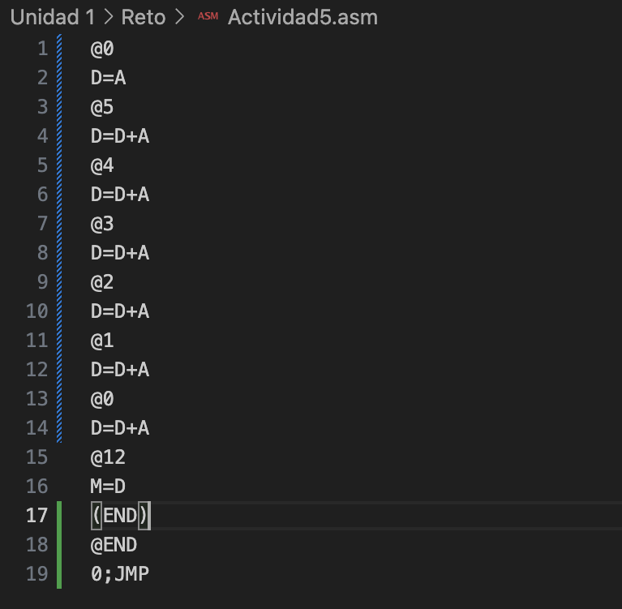
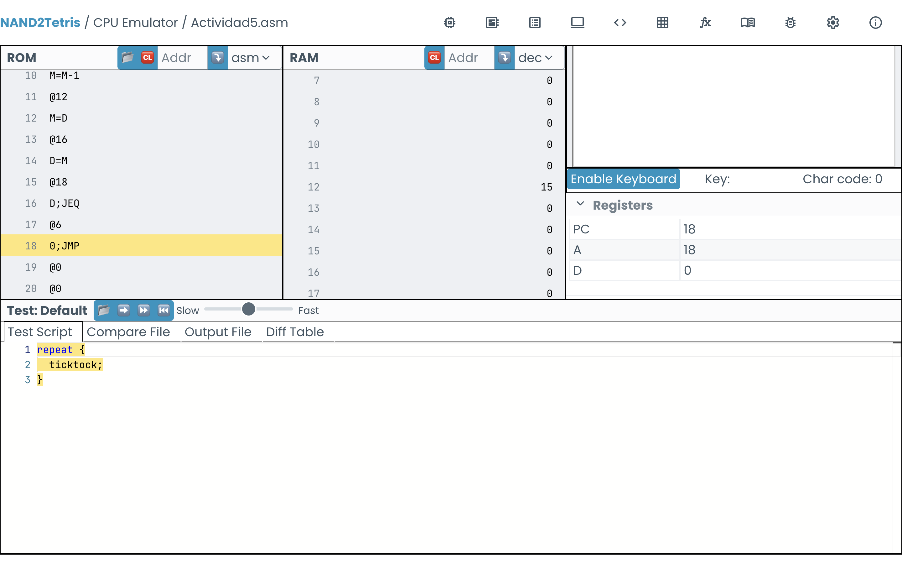
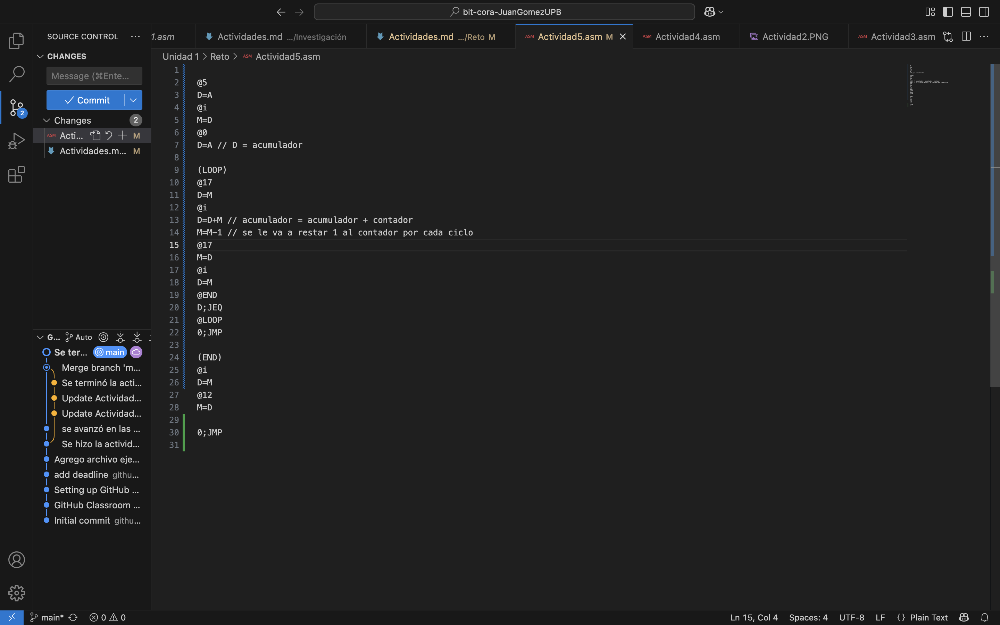
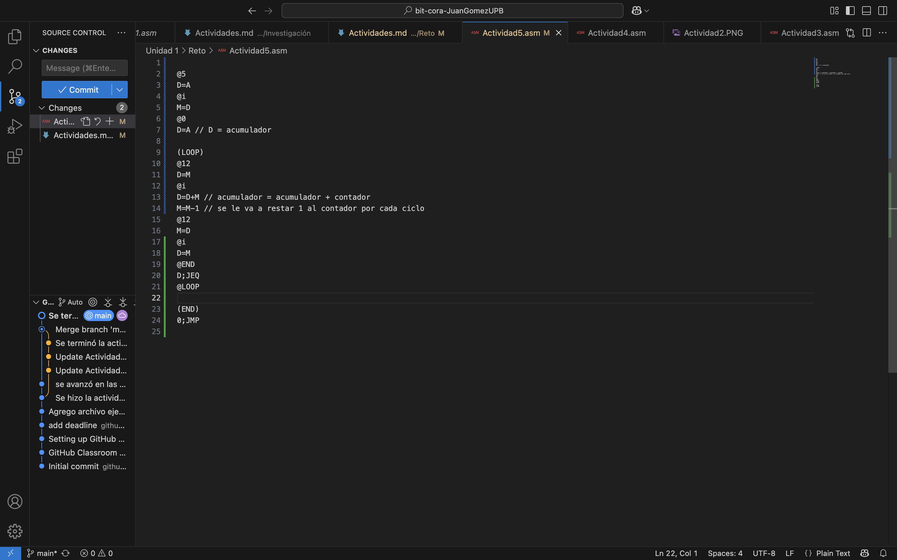

# Actividad 4
.png)
.png)
.png)
# Actividad 5
- Primero imaginé como se vería el ciclo con el contador y acumulador y luego lo escribí completo sin el ciclo:

- Luego trabaje en el loop, la idea inicial era hacer el loop primero y luego mover el valor a la memoria 12. Guardaba el valor acumulado en la memoria 17 durante el loop. Sin embargo, cuando lo probe me di cuenta de que el 15 se quedaba guardado en el 17 y nunca se trasladaba a la memoria 12.

- Viendo lo que había sucedido, decidí reemplazar directamente el @17 por @12 y acabar el código directamente cuando se acabra el loop.

# Actividad 6
## Parte 1: recuperación de conocimento (retrieval practice)
1. Describe con tus palabras las tres fases del ciclo Fetch-Decode-Execute. ¿Qué rol juega el Program Counter (PC) en este ciclo?
--> Las tres fases del ciclo fetch decode execute se pueden resumir en: Fetch, el program counter busca la siguiente instrucción en el ROM. Decode, se lee la instrucción. Execute, el programa ejecuta las instrucciones. Por ejemplo, para @10. Primero el PC busca que instrucción sigue, luego se define que dice la instrucción y luego se ejecuta (el 10 se guarda en la a).
2. Cuál es la diferencia fundamental entre una instrucción-A (que empieza con @) y una instrucción-C (que involucra D, M, A, etc.) en el lenguaje ensamblador de Hack? Da un ejemplo de cada una.
--> La instrucción A (@) sirve para poner un valor en el registro A, esta es una dirección y se puede usar como un número a disposición del usuario. La instrucción C se encarga de todo lo que se hace con esos datos, entonces los guarda en D o en M, o los suma entre ellos D=D+A, o guarda datos temporales (D=A), etc.
3. Explica la función de los siguientes componentes del computador Hack: el registro D, el registro A y la ALU.
--> El registro A guarda direcciones, el registro D se usa para guardar datos temporales mientras se llevan a cabo las instrucciones, la ALU es la parte del computador que hace las cuentas y comparaciones.
4. ¿Cómo se implementa un salto condicional en Hack? Describe un ejemplo (p. ej., saltar si el valor de D es mayor que cero).
--> Un salto condicional ocurre cuando el programa cambia de lugar solo si cumple una condición específica. Primero se carga la dirección a la que se quiere saltar y luego se usa una instrucción como, por ejemplo, D;JGT, que salta solo si D es mayor que cero.
5. ¿Cómo se implementa un loop en el computador Hack? Describe un ejemplo (p. ej., un loop que decremente un valor hasta que llegue a cero).
--> Un loop se hace usando una etiqueta y un salto. El programa vuelve a una misma parte del código mientras se cumpla una condición. Por ejemplo, se puede ir restando 1 a un valor y repetir el ciclo hasta que llegue a cero como se hizo en la Actividad 6.
6. ¿Cuál es la diferencia entre la instrucción D=M y la instrucción M=D?
--> D=M significa leer un valor de la memoria y guardarlo en D. M=D significa tomar el valor de D y guardarlo en la memoria. 
7. Describe brevemente qué se necesita para leer un valor del teclado (KBD) y para “pintar” un pixel en la pantalla (SCREEN).
--> Para leer el teclado se usa la dirección especial KBD, donde aparece la tecla presionada. Para pintar en la pantalla se escribe un valor en la memoria SCREEN, donde cada posición controla píxeles de la pantalla.
## Parte 2: reflexión sobre tu proceso (metacognición)
1. ¿Cuál fue el concepto o actividad más desafiante de esta unidad para ti y por qué?
--> La actividad 6 fue la más compleja, puesto que se requirió la lógica de todo lo que vimos durante la unidad.
2. La metodología de “predecir, ejecutar, observar y reflexionar” fue central en nuestras actividades. ¿En qué momento esta metodología te resultó más útil para entender algo que no tenías claro?
--> Con el @17 me di cuenta de que el programa estaba guardando la suma en el @17 y que el loop no terminaba nunca, por lo que el número nunca se trasladaría a la memoria 12.
3. Describe un momento “¡Aha!” que hayas tenido durante estas dos semanas. ¿Qué estabas haciendo cuando ocurrió?
--> De nuevo, uno de los momentos más importantes y el momento "aha" fue cuando me di cuenta de cual era el error en la actividad 6, puesto que estaba haciendo pasos extra y esto estaa entorpeciendo el código. Al reemplazar el @17 por @12 no solo recorte el código, sino que solucione el problema de que el valor no se guardara en la memoria adecuada.
4. Pensando en la próxima unidad, ¿Qué harás diferente en tu proceso de estudio para aprender de manera más efectiva?
--> En la proxima unidad tratare de no dejar las cosas para ultimo minuto, puesto que al final el trabajar sobre el tiempo genera mucho estres y que uno no piense claridad.