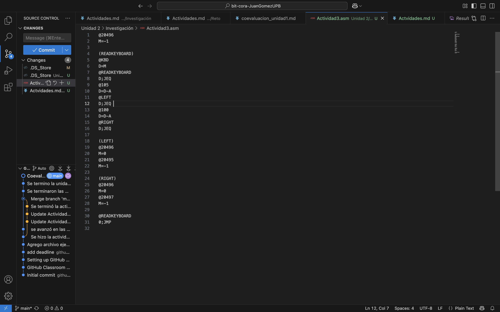
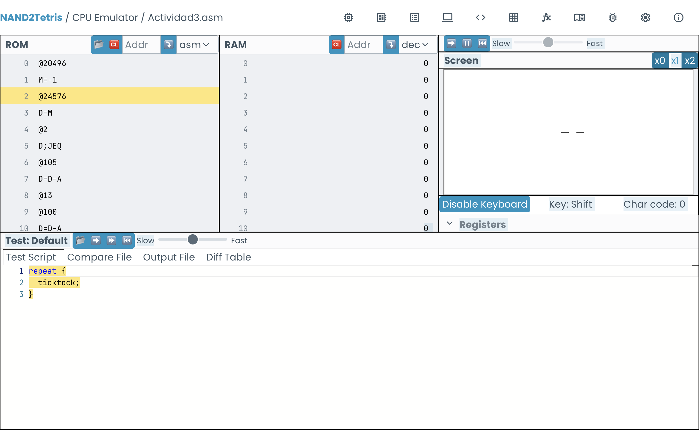
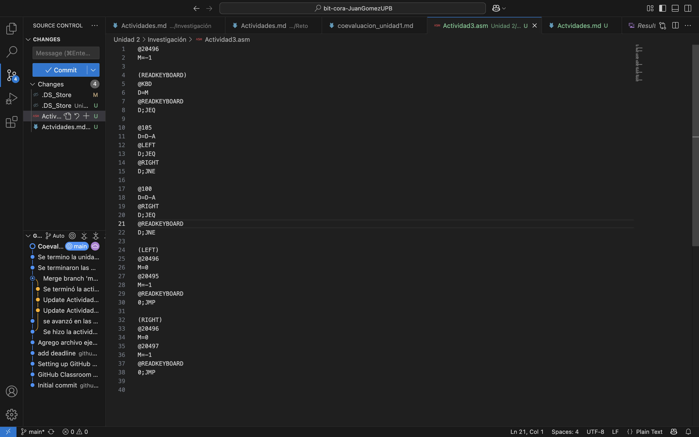

# Actividad 3
1.  Lo primero que hice fue escribir el código de tal manera que si a D se le resta el número del código de la tecla y la respuesta es 0, entonces se ejecute la acción: moverse a la izquierda o derecha. Sin embargo, una vez pulsaba la tecla D se dibujaban dos líneas en vez de dibujarse una sola en la izquierda.

2. Para solucionar el error hice pequeños cambios en el código. El más importante fue que lo escribí en una clase de "secuencia", en la que primero se pregunta si la tecla presionada es distanta a "d" o "i", luego se pregunta si es distinta a "d" y de serlo se asume que es "i".

3. El problema a solucionar ahora, era que se borrara la línea, que se había dibujado anteriormente, cuando presionara la otra tecla. Esto se soluciono haciendo que la dirección RAM de la derecha o izquierda se borrará cada vez que se dibujaba la línea en el lado opuesto. El problema es que esto se hizo de manera "manual", directamente igualando el contenido la dirección de la RAM a 0. Es decir, el programa solo era funcional mientras la línea se moviera en una dirección a la derecha o izquierda.

4. 

# Actividad 4
