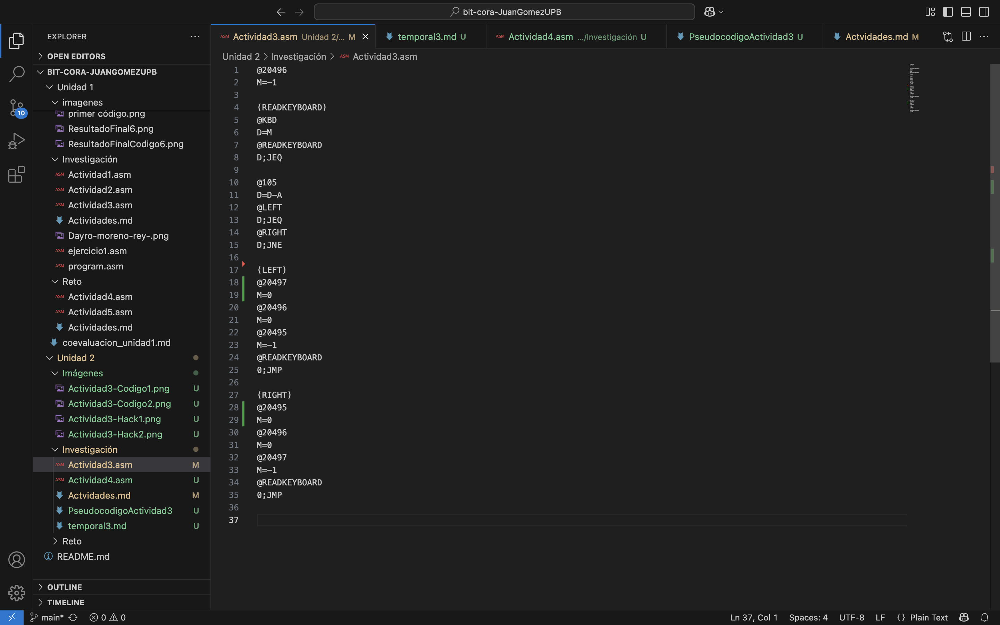
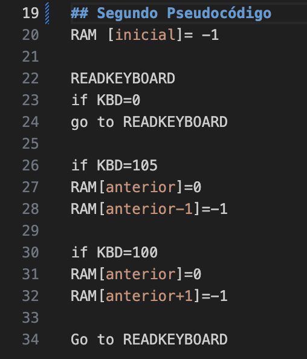
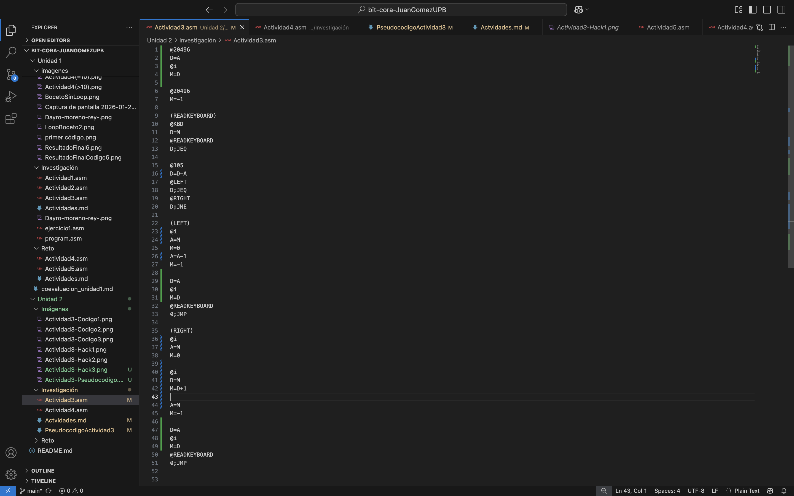
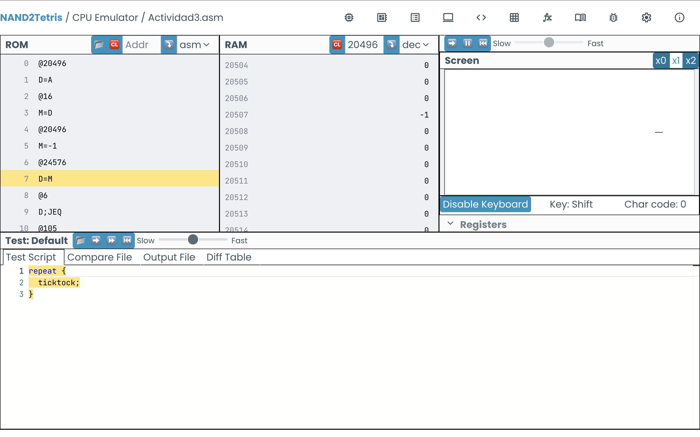
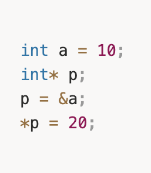
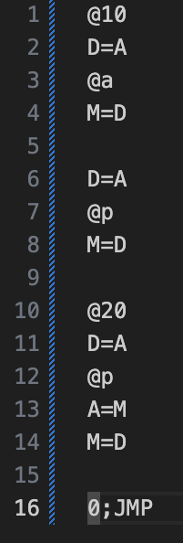
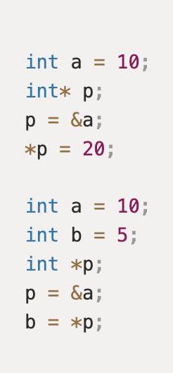
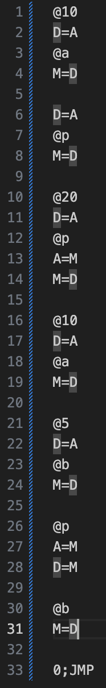
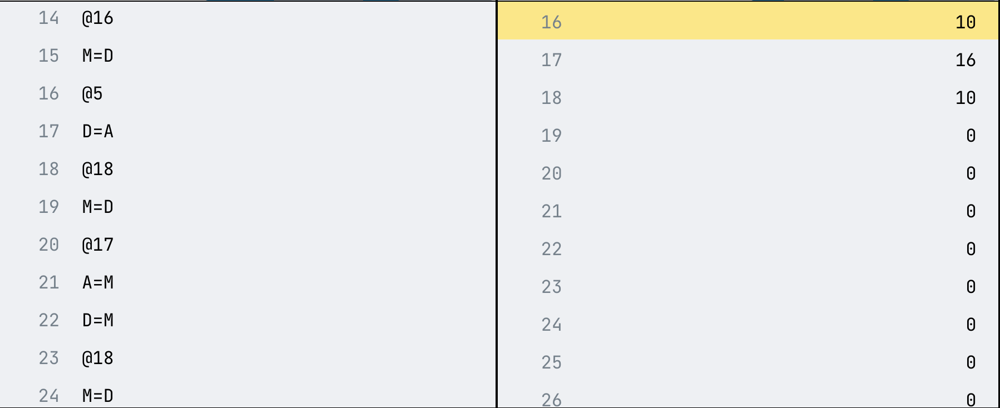

# Actividad 2 y 3
1.  Lo primero que hice fue escribir el código de tal manera que si a D se le resta el número del código de la tecla y la respuesta es 0, entonces se ejecute la acción: moverse a la izquierda o derecha. Sin embargo, una vez pulsaba la tecla D se dibujaban dos líneas en vez de dibujarse una sola en la izquierda.

2. Para solucionar el error hice pequeños cambios en el código. El más importante fue que lo escribí en una clase de "secuencia", en la que primero se pregunta si la tecla presionada es distanta a "d" o "i", luego se pregunta si es distinta a "d" y de serlo se asume que es "i".

3. El problema a solucionar ahora, era que se borrara la línea, que se había dibujado anteriormente, cuando presionara la otra tecla. Esto se soluciono haciendo que la dirección RAM de la derecha o izquierda se borrará cada vez que se dibujaba la línea en el lado opuesto. El problema es que esto se hizo de manera "manual", directamente igualando el contenido la dirección de la RAM a 0. Es decir, el programa solo era funcional mientras la línea se moviera solo una dirección a la derecha o izquierda.

4. Para el resultado final, escribí un código en el que la posición de la línea se guardara en la memoria @i, de forma que esa posición pudiera cambiar independientemente de su posición en la pantalla. Como se ve en el segundo pseudocódigo:

# Actividad 4
1. En la primera parte de la actividad, p representa al puntero. El código lo escribí de modo que primero se crea la variable "a"; dirección 16 en la memoria RAM (en Hack). Luego "p" (dirección 17 en la memoria RAM) guarda la dirección "a" en su memoria. Guardé el valor de 20 en D y luego volví a llamar a "p", luego escribí que la dirección fuera la del valor de la memoria de "p", es decir "a". Ya en "a", iguale a M a D (M=D). Si todo esta correcto, la dirección 16 de la memoria RAM debería ser igual 20 y la dirección 17 debría ser igual a 16.

2. Para la segunda parte, se añadió la variable "b". Primero le di a "a" el nuevo valor de 10 y a "b" le di el valor de 5. Vuelvo a llamar al puntero "p", que tiene guardado en su memoria la dirección de "a" y luego escribo: A=M. Ya estando en la dirección de "a", guardo el valor de su memoria, es decir 10, en D. Luego llamo a "b" y guardo en su memoria el valor de D (M=D). Si todo es correcto, las direcciones 16 y 18 (dirección de "b") debrían ser ambas 10 y la dirección 17 debría seguir teniendo el valor de "p", es decir 16.

