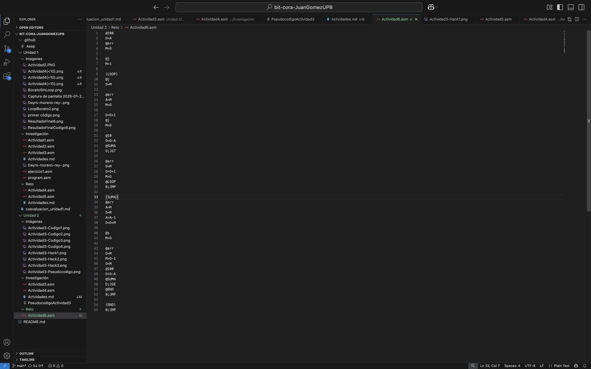
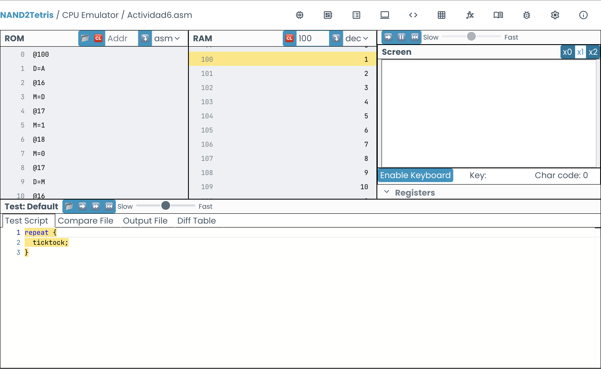
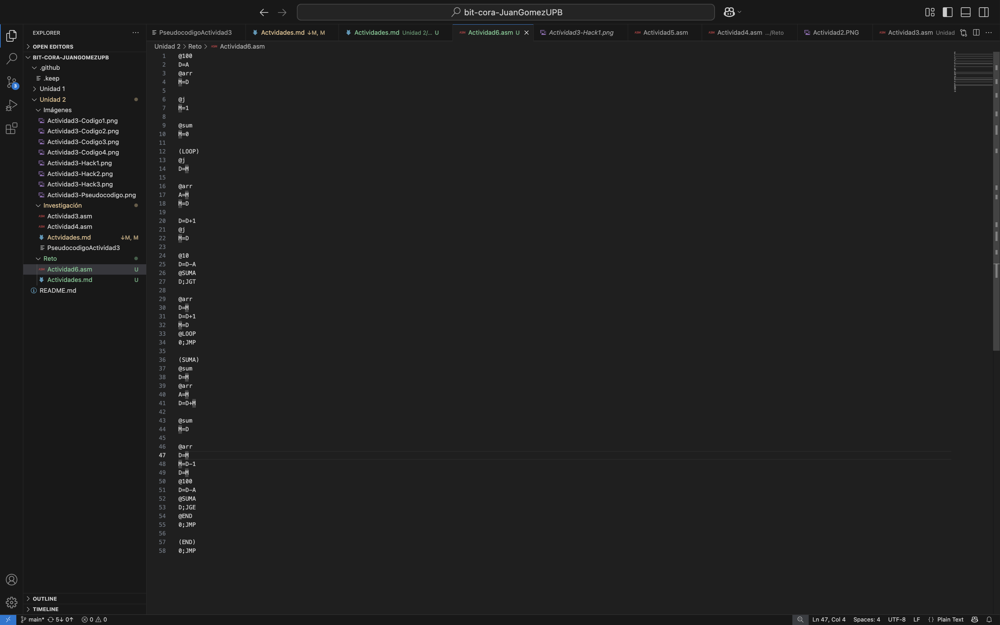

# Actividad 6
1. Inicialmente, cree un bucle (LOOP) que llenara el arreglo del 1 al 10, para esto cree una variable llamada "arr", que funcionaba como puntero, puesto que guardaba la posición del arreglo: 100. Además cree una variable j, que funciona como contador. Para la suma, ya que la memoria del arreglo sigue en 109 (despues del LOOP), cree un bucle en el que se llamaba a la memoria del arreglo (109) y la sumaba con la memoria del numero anterior (108), el resultado se guarda en la memoria de la variable @suma. El bucle SUMA se repite hasta la dirección 100.

2. La suma no daba el valor esperado, que era 55. Por esta razón reescribí el código, inicializando la variable suma desde el principio:

