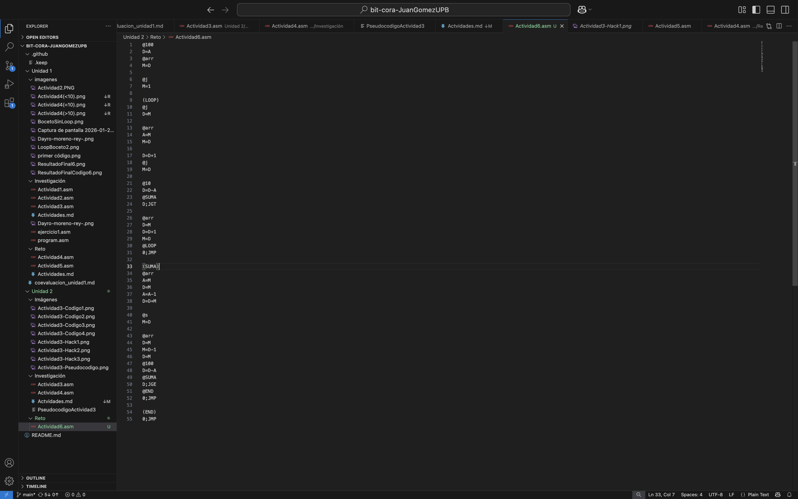
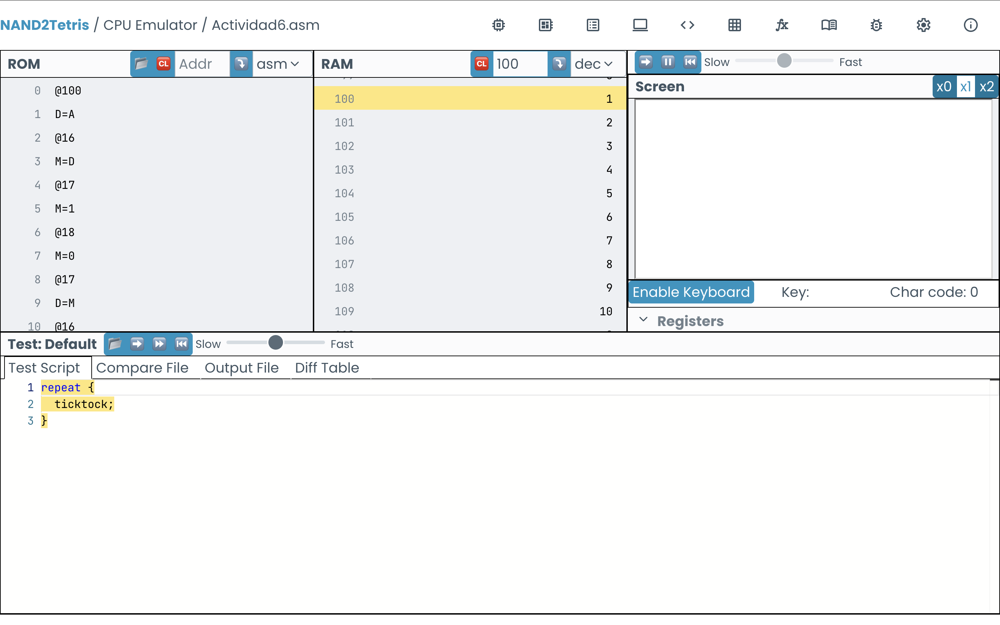
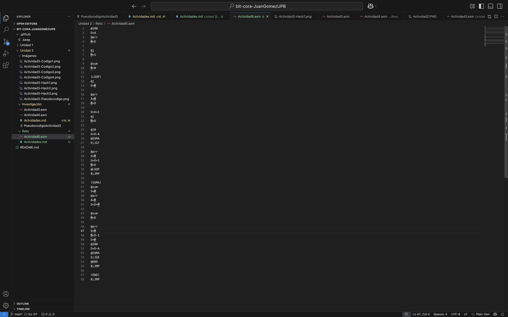
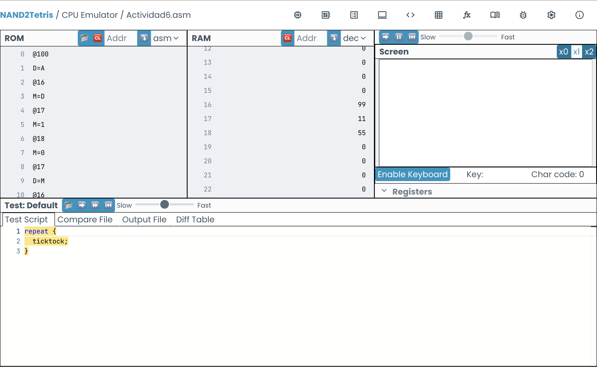

# Actividad 6
1. Inicialmente, cree un bucle (LOOP) que llenara el arreglo del 1 al 10, para esto cree una variable llamada "arr", que funcionaba como puntero, puesto que guardaba la posición del arreglo: 100. Además cree una variable j, que funciona como contador. Para la suma, ya que la memoria del arreglo sigue en 109 (despues del LOOP), cree un bucle en el que se llamaba a la memoria del arreglo (109) y la sumaba con la memoria del numero anterior (108), el resultado se guarda en la memoria de la variable @suma. El bucle SUMA se repite hasta la dirección 100.



2. La suma no daba el valor esperado, que era 55. Por esta razón reescribí el código, inicializando la variable suma desde el principio:




### Temporalmente*
# Actividad 3 2OC4
|Variables globales y estáticas| 
|-----------|
|int global_inicializada = 42
int global_no_inicializada
static int var_estatica 

|Heap| 
|-----|
|int* arr = new int[tam]

|Stack|
|-----|
|int a = 10
int b = 20
int c = suma(a, b)
int tamArray = 10;
int* arrayHeap = crearArrayHeap(tamArray);

# Actividad 4

## Experimento 1
En este experimento el código declara dos variables en el main, luego por medio de la función:
``` cpp
void* ptr = reinterpret_cast<void*>(&main);
```
lo que estoy haciendo es crear un puntero *ptr* que va a almacenar la dirección de memoria en la que está guardada la función main, esto se accede por medio de *&main*, después se va a imprimir en la pantalla el valor guardado en *ptr*, y finalmente el programa intenta cambiar el valor que está dentro de la RAM, en este caso quiere borrar el main y poner un cero en esa direccion de memoria donde está almacenado

## Experimento 2
Este experimento es casi igual al primero, con la diferencia de que se crea una variable global
```cpp 
const char* const mensaje_ro = "Hola, memoria de solo lectura";
```
La siguiente parte del código se crea una variable de un puntero, pero este estará asignado como un char y no un void como en la anterior, debido a esto el valor que se mostrará en la pantalla será un dibujo extraño y no una direccion de memoria directamente, el resultado será el siguiente:
"Voy a modificar la memoria en la direccion: └╗Ü▓¸". Igual que en el anteror está intentando cambiar la información que hay dentro de la dirección de memoria que se llamó anteriormente porque es una sección de solo lectura

## Experimento 3
En este experimento se declaran dos variables globales y se muestran estas variables como fueron declaradas inicialmente, luego se cambian los valores que contienen estas variables denttro de la función main y se muestran los nuevos valores almacenados en estas variables, en este caso simplemente se mostrarán los nuevos valores.

## Experimento 4
En esta situacion el código presenta un error que no le permite mostrar los resultados, la variable que está decalrada en 
```cpp
void funcionConStatic() {    
		static int var_estatica = 100;    
		cout << "Dirección de var_estatica (static): " << &var_estatica << endl;
}
```
Como solamente está declarada dentro de esta función, cuando se llama a esa variable en el main no es una variable que esté declarada en el main, así que no es posible realizar ninguna modificación en este caso y por lo mismo el código muestra un mensaje de error, entonces seria necesario llamar la función y no la variable en específico.

## Experimento 5
En este experimento se crean dos variables, una estática y otra que no es estática, luego se crea un ciclo que va a aumentar dichas variables de 1 en 1 hasta que se hayan aumentado 5, en este caso la variable estática va a ir modificandose y conservando la nueva información por lo que al final el valor será de 105, por otro lado la variable que no es estática no almacenará la nueva información y por ende no se le sumará nada, su valor inicial y final serán los mismos.

## Experimento 6 
Aquí se crea un arreglo, inicialmente se creauna variable local que determina el tamaño del aarreglo, luego se declara la variable del arreglo y se le atribuye su respectivo tamaño, fianlmente se inicializa un ciclo que va a recorrer todos los espacios del arreglo, además indicará en que espacio de memoria está almacenado cada uno, finalmente se borra la informacion del arreglo

# Actividad 5 
1. Explica qué ocurre al copiar un objeto en C++ y en C#. ¿Qué diferencias encuentras?
En **C#** el código crea el objeto original y le da sus atributos. Luego se establece que la copia es igual al original y cuando se imprime la copia se le da sus valores orrespondientes pero cuando se imprime el original uevamente todos sus valores se modificaron a los de la copia. Por otra parte en **C++** se crea el objeto original y se le asignan sus respectivas variables, luego se crea una referenciacion a este mismo objeto, se crea el objeto de la copia y se modifica la información, pero al imprimir el original los valores iniciales se mantienen en el mismo, se está creando una verdadera copia del objeto y no modificando los valores iniciales como en *C#* pero con el punto p que es la referenciacion a el objeto original si se le atribuyen valores a este mismo se modificarán los valores originales.

2. ¿Qué es `copia` en C++ y en C#? ¿Es una copia independiente de `original`?
En **C++** una copia referencia al objeto original, le puede atribuir nuevas características o valores pero al final es independiente del objeto original, por otra parte en **C#** la copia es entregarle los valores del original a una copia y permitir que se modifiquen los valores de este mismo en un "nuevo objeto" pero igualmente los valores del original también van a cambiar.

## Actividad integradora
Predicción (sin ejecutar el código):
1. ¿Cuál será la salida final en la consola de este programa?
--> La salida final del programa va a mostrar: el valor de **a** va a ser igual, porque es una suma por valor. El valor **b** y **c** si van a cambiar como lo dice la suma, porque son sumas por referencia y por puntero. Por su parte, el contador, al ser estatico va a ir sumando de 1 en 1, es decir, aunque al principio de la función se declare que su valor es 0, como es un valor estatico se va seguir sumando de 1 en 1 y el valor final va a ser 3. 
2. Escribe la salida completa que esperas.

3. Dibuja un mapa de memoria conceptual de este programa justo antes de que main finalice. Debes indicar en qué segmento de memoria (Stack, Heap, Datos Globales/Estáticos, Código) se encontraría cada una de las siguientes variables: contador_global, contador_estatico, val_A, val_B, val_C (dentro de main), el parámetro a de la función sumaPorValor, la función main misma.
B. Verificación y análisis (usando el depurador):
Ejecuta el programa paso a paso (F10) con un breakpoint al inicio de main.
1. Compara la salida real con tu predicción. Si hubo diferencias, explica por qué ocurrieron. Evidencia clave: capturas de pantalla antes y después de los puntos de interés (¿Cuáles son esos puntos? -> tu tarea analizarlo).
2. Describe qué demuestran estas capturas sobre la diferencia entre los diferentes tipos de paso por parámetros analizados.
3. Explica con tus propias palabras el comportamiento de contador_estatico. ¿Por qué “recuerda” su valor entre llamadas a la función ejecutarContador? ¿En qué se diferencia de una variable local normal?
