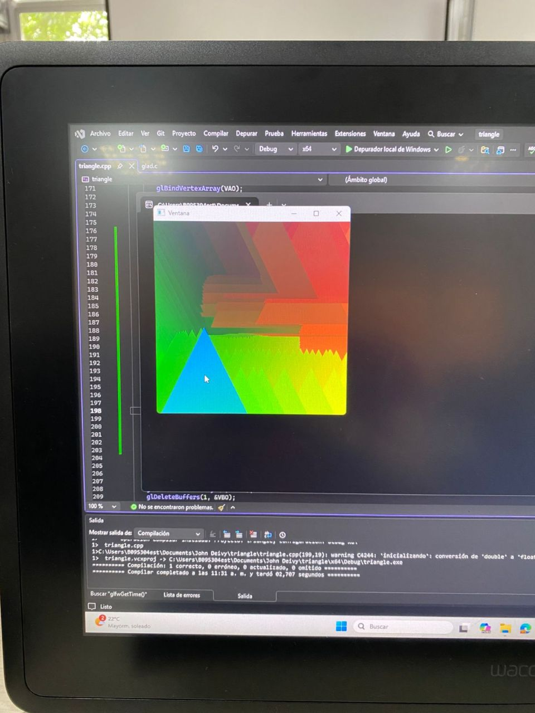

# Actividad 6
**1. **Necesitas obtener el tiempo:** la biblioteca GLFW proporciona una función muy útil para esto: `glfwGetTime()`. Esta función devuelve el tiempo en segundos (como un `double`) desde que se inicializó GLFW.**

**2. **Pasar el tiempo al shader:** ¿Cómo puedes enviar información desde tu código C++ al shader, información que es la misma para todos los vértices y fragmentos en un **draw call** específico?**

**3. **Modificar el color en el shader:** dentro del `main()` de tu *fragment shader*, ya no usarás un color fijo ni dependerás directamente del `uniform` del mouse (si partiste de la Actividad 05). Ahora, usarás el `uniform` del tiempo para calcular el color.
    - **Idea:** Las funciones trigonométricas como `sin()` o `cos()` son excelentes para crear ciclos suaves. Por ejemplo, `(sin(time) + 1.0) / 2.0` produce un valor que oscila suavemente entre 0.0 y 1.0. Puedes usar esto para modular uno o más componentes (R, G, B) del color. ¡Experimenta!**

		float timeValue = glfwGetTime();
		float red = (sin(timeValue) * 0.5f) + 0.5f;
		float green = (sin(timeValue + 2.0f) * 0.5f) + 0.5f;
		float blue = (sin(timeValue + 4.0f) * 0.5f) + 0.5f;
		glUniform4f(colorLocation, red, green, blue, 1.0f);
	
     